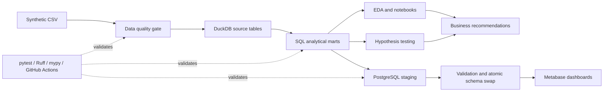
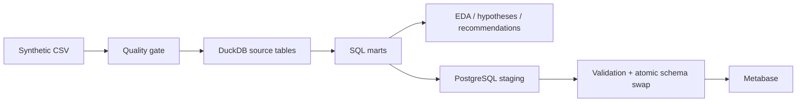

# DeliveryPulse

DeliveryPulse — завершённый портфолио-проект аналитики данных вымышленной
логистической компании. Он воспроизводит полный путь от генерации и контроля
качества синтетических данных до SQL-витрин, EDA, проверки гипотез и
evidence-based бизнес-рекомендаций. DuckDB служит источником истины, а
PostgreSQL и Metabase образуют дополнительный publish- и BI-контур.

> **Статус:** этапы 1–8 завершены · portfolio release **v1.0.x** · все данные
> синтетические.

## Ключевые возможности

- детерминированный генератор связанных логистических данных;
- независимый data quality pipeline с JSON, CSV и Markdown-отчётами;
- DuckDB warehouse и пять SQL-витрин с проверенным зерном;
- воспроизводимые EDA, графики и Jupyter Notebooks;
- формальная проверка H1–H6 с effect size, 95% CI и диагностикой моделей;
- evidence-gated рекомендации, pilot plans и decision register;
- транзакционный optional publish из DuckDB в PostgreSQL;
- локальный Metabase-контур через Docker Compose;
- doctor CLI, pytest, Ruff, mypy и GitHub Actions CI.

## Основные результаты анализа

| Гипотеза | Результат | Интерпретация |
|---|---|---|
| H1 — loading delay | `not_supported` | бинарный фактор не поддержан; duration signal остаётся secondary |
| H2 — express и опоздания | `supported` | связь сохраняется после контроля состава рейсов |
| H3 — breakdown и убыток | `supported` | поломки связаны с высокой концентрацией убыточных доставок |
| H4 — обслуживание и поломки | `inconclusive` | текущая модель недостаточно устойчива для изменения интервалов ТО |
| H5 — клиентская прибыльность | `supported` | различия сохраняются после контроля route и order mix |
| H6 — операционный перегруз | `inconclusive` | недостаточно событий для надёжного сегментного вывода |

Результаты основаны на синтетических наблюдательных данных. Статистическая
связь не доказывает причинность, а `not_supported` не доказывает отсутствие
эффекта.

## Приоритетные рекомендации

- **R1 Express — P1:** ограниченный pilot SLA, планирования ресурсов и
  маршрутных буферов.
- **R2 Поломки — P1:** pilot резервирования транспорта, времени реакции и
  контроля breakdown costs.
- **R3 Клиенты — P2:** коммерческий review клиентов достаточного объёма с
  контролем route mix, SLA, retention и маржи.

R5 остаётся направлением сбора данных, а R6 — HOLD без изменения safety limits.

## Архитектура



## Быстрый запуск

Linux:

```bash
python3 -m venv .venv
source .venv/bin/activate
python -m pip install -e ".[dev,notebook]"
python -m delivery_pulse generate --profile demo --seed 42
python -m delivery_pulse quality \
  --input-dir data/raw --output-dir reports/quality
python -m delivery_pulse warehouse build \
  --input-dir data/raw \
  --database data/processed/delivery_pulse.duckdb
python -m delivery_pulse warehouse validate \
  --database data/processed/delivery_pulse.duckdb
python -m delivery_pulse eda \
  --database data/processed/delivery_pulse.duckdb \
  --output-dir reports
```

Эквивалентные команды Windows PowerShell приведены в разделах ниже. Полный
контур продолжается командами `hypotheses run`, `recommendations build` и,
опционально, `publish postgres`.

## Основные документы и ноутбуки

- [Техническое задание](PROJECT.md) и [roadmap](ROADMAP.md);
- [модель данных](docs/data_model.md), [метрики](docs/metrics.md) и
  [правила качества](docs/data_quality_rules.md);
- [DuckDB warehouse](docs/warehouse.md) и
  [результаты EDA](docs/eda_findings.md);
- [protocol](docs/hypothesis_protocol.md) и
  [результаты гипотез](docs/hypothesis_results.md);
- [бизнес-рекомендации](docs/business_recommendations.md) и
  [executive summary](docs/executive_summary.md);
- [engineering-контур](docs/engineering.md),
  [Metabase](docs/metabase.md) и
  [portfolio walkthrough](docs/portfolio_walkthrough.md);
- [01 Data Quality](notebooks/01_data_quality.ipynb),
  [02 EDA](notebooks/02_exploratory_analysis.ipynb),
  [03 Hypothesis Testing](notebooks/03_hypothesis_testing.ipynb),
  [04 Recommendations](notebooks/04_business_recommendations.ipynb).

## Ограничения

- используются только синтетические данные без реальных компаний и
  персональных данных;
- анализ наблюдательный и не устанавливает причинность;
- сценарии рекомендаций являются иллюстрациями, а не финансовым прогнозом;
- PostgreSQL и Metabase — optional publish-слой, DuckDB остаётся source of
  truth;
- локальный Compose не заменяет production security, backup, HA и SSO;
- реальные решения требуют повторной проверки и pilot на корпоративных данных.

## Стек технологий

Python 3.11+, pandas, NumPy, DuckDB, SQL, SciPy, statsmodels, matplotlib,
Jupyter, pytest, Ruff, mypy, PostgreSQL/psycopg, Metabase, Docker Compose,
GitHub Actions и Git.

## Аналитическая идея

Модель разделяет:

- маршрут — нормативное направление с расстоянием и временем в пути;
- заказ — коммерческое обязательство перед клиентом;
- доставку — конкретное исполнение заказа;
- события маршрута — операционные причины отклонений;
- техническое обслуживание — состояние автопарка;
- выручку и затраты — экономику отдельной доставки.

Основные аналитические показатели: on-time delivery rate, длительность и
величина опоздания, прибыль и маржа, стоимость километра, простои и надёжность
автомобилей, включая поломки на 10 000 км и 1 000 часов рейсов.

Контракты первого релиза: все суммы выражены в RUB; временные метки хранятся в
UTC, а бизнес-календарь и отображение используют `Europe/Moscow`. `NULL` в
финансовых данных означает неизвестное значение, а `0` — известное отсутствие
затрат.

## Документация

- [Техническое задание](PROJECT.md)
- [Roadmap](ROADMAP.md)
- [Модель данных](docs/data_model.md)
- [Метрики](docs/metrics.md)
- [Гипотезы](docs/hypotheses.md)
- [Сценарии генерации](docs/generation_scenarios.md)
- [Правила контроля качества](docs/data_quality_rules.md)
- [DuckDB и SQL-слой](docs/warehouse.md)
- [Выводы EDA и кандидаты гипотез](docs/eda_findings.md)
- [Протокол проверки гипотез](docs/hypothesis_protocol.md)
- [Результаты проверки гипотез](docs/hypothesis_results.md)
- [Бизнес-рекомендации](docs/business_recommendations.md)
- [Engineering-контур](docs/engineering.md)
- [Metabase](docs/metabase.md)
- [Portfolio walkthrough](docs/portfolio_walkthrough.md)
- [Правила работы в репозитории](AGENTS.md)

## Структура проекта

```text
data/       локальные raw-, processed-данные и витрины
docs/       модель, метрики и гипотезы
notebooks/  последовательный аналитический рассказ
reports/    воспроизводимые изображения и итоговые материалы
sql/        DDL, витрины, hypotheses и dashboard-запросы
src/        генерация, quality, warehouse, analysis, publish и CLI
tests/      unit, smoke и opt-in integration tests
.github/    CI без full generation и внешней публикации
compose.yaml  optional PostgreSQL + Metabase
```

Полная структура описана в [PROJECT.md](PROJECT.md).

## Установка на Linux

```bash
python3 -m venv .venv
source .venv/bin/activate
python -m pip install --upgrade pip
python -m pip install -e ".[dev]"
```

## Установка на Windows PowerShell

```powershell
py -m venv .venv
.\.venv\Scripts\Activate.ps1
python -m pip install --upgrade pip
python -m pip install -e ".[dev]"
```

## Проверки качества

После активации виртуального окружения команды одинаковы на Linux и Windows:

```text
python -m pytest
python -m ruff check .
python -m ruff format --check .
python -m mypy src
```

## CLI

Показать сведения о проекте и доступности рабочих каталогов:

```text
python -m delivery_pulse info
```

Безопасно создать отсутствующие локальные каталоги:

```text
python -m delivery_pulse init
```

`init` не удаляет и не перезаписывает существующие файлы. Основной Python-код
не требует Bash и использует `pathlib.Path`.

## Генерация данных

Профили: `test` для автотестов, `demo` для ручной проверки и `full` для
основного набора из 50 000 заказов.

Linux:

```bash
python -m delivery_pulse generate \
  --profile demo \
  --seed 42
```

Windows PowerShell:

```powershell
python -m delivery_pulse generate `
  --profile demo `
  --seed 42
```

Доступные параметры:

```text
--orders N
--seed N
--start-date YYYY-MM-DD
--months N
--output-dir PATH
--profile {test,demo,full}
--inject-quality-issues
--force
```

По умолчанию CSV записываются в `data/raw`, а `metadata.json` — в
`data/metadata`. Для пользовательского `--output-dir .../raw` metadata
сохраняется в соседнем каталоге `.../metadata`. Команда без `--force` не
перезаписывает существующие файлы.

## Данные и воспроизводимость

Генератор управляется явным seed и не использует глобальное случайное состояние.
Сгенерированные датасеты и локальные базы исключены из Git и воспроизводятся
локально. Проект не содержит секреты или настоящие
данные компаний. Операционные перегрузы анализируются как бизнес-события, а
намеренные дефекты качества фиксируются в отдельном техническом manifest,
доступном тестам, но не аналитическому коду.

Обязательная глубокая проверка выполняется для шести приоритетных гипотез.
Остальные гипотезы дополнительные; генератор не обязан подтверждать их все.

## Контроль качества данных

Сначала создайте demo-набор, затем запустите независимую проверку. Raw CSV
открываются только для чтения и никогда не исправляются на месте.

Linux:

```bash
python -m delivery_pulse generate \
  --profile demo \
  --seed 42 \
  --output-dir data/raw

python -m delivery_pulse quality \
  --input-dir data/raw \
  --output-dir reports/quality
```

Windows PowerShell:

```powershell
python -m delivery_pulse generate `
  --profile demo `
  --seed 42 `
  --output-dir data/raw

python -m delivery_pulse quality `
  --input-dir data/raw `
  --output-dir reports/quality
```

Quality CLI поддерживает `--format {csv,json}`, `--fail-on
{critical,error,warning}` и `--max-samples N`. Код 0 означает пригодный набор
(возможно, с неблокирующими предупреждениями), код 1 — обнаруженные
блокирующие проблемы, код 2 — ошибку запуска или параметров. Создаются JSON
summary, CSV проблем, Markdown-отчёт и профиль таблиц.

Для проверки ноутбука установите отдельный минимальный extra:

Linux:

```bash
python -m pip install -e ".[dev,notebook]"
```

## DuckDB warehouse

Сборка запускает quality gate, загружает только восемь ожидаемых CSV и
атомарно публикует базу после validation. Raw CSV не изменяются, технический
manifest в базу не загружается.

Linux:

```bash
python -m delivery_pulse warehouse build \
  --input-dir data/raw \
  --database data/processed/delivery_pulse.duckdb

python -m delivery_pulse warehouse validate \
  --database data/processed/delivery_pulse.duckdb

python -m delivery_pulse warehouse info \
  --database data/processed/delivery_pulse.duckdb

python -m delivery_pulse warehouse baseline \
  --database data/processed/delivery_pulse.duckdb
```

Windows PowerShell:

```powershell
python -m delivery_pulse warehouse build `
  --input-dir data/raw `
  --database data/processed/delivery_pulse.duckdb

python -m delivery_pulse warehouse validate `
  --database data/processed/delivery_pulse.duckdb

python -m delivery_pulse warehouse info `
  --database data/processed/delivery_pulse.duckdb

python -m delivery_pulse warehouse baseline `
  --database data/processed/delivery_pulse.duckdb
```

Без `--force` существующая база не перезаписывается. `passed_with_warnings`
разрешает сборку с явным предупреждением, а `failed` возвращает код 1 и не
создаёт базу. Подробные зерно, lineage и NULL-правила описаны в
[`docs/warehouse.md`](docs/warehouse.md).

## Разведочный анализ

EDA читает только проверенный DuckDB warehouse, не изменяет базу или raw CSV и
создаёт Markdown-отчёт с отдельными PNG. Наблюдения относятся к синтетическим
данным, не являются причинными выводами и не заменяют формальную проверку
гипотез на этапе 6.

Linux:

```bash
python -m delivery_pulse eda \
  --database data/processed/delivery_pulse.duckdb \
  --output-dir reports \
  --top-n 10 \
  --min-group-size 30
```

Windows PowerShell:

```powershell
python -m delivery_pulse eda `
  --database data/processed/delivery_pulse.duckdb `
  --output-dir reports `
  --top-n 10 `
  --min-group-size 30
```

Полностью воспроизводимый рассказ находится в
`notebooks/02_exploratory_analysis.ipynb`. Перед его запуском база должна быть
построена командой `warehouse build`. Локальные результаты создаются в
`reports/eda_summary.md` и `reports/figures/eda/` и не добавляются в Git.

## Формальная проверка гипотез

Этап 6 использует заранее зафиксированный protocol, наблюдательные модели,
95%-доверительные интервалы и Benjamini–Hochberg для шести primary tests.
Основной анализ предназначен для профиля `full`, 50 000 заказов и seed 42.

Linux:

```bash
python -m delivery_pulse hypotheses run \
  --database data/processed/delivery_pulse.duckdb \
  --output-dir reports/hypotheses \
  --alpha 0.05 \
  --seed 42 \
  --min-group-size 90
```

Windows PowerShell:

```powershell
python -m delivery_pulse hypotheses run `
  --database data/processed/delivery_pulse.duckdb `
  --output-dir reports/hypotheses `
  --alpha 0.05 `
  --seed 42 `
  --min-group-size 90
```

`hypotheses info` показывает параметры protocol. Код 0 означает технически
завершённый анализ без `inconclusive`; код 1 — корректно выполненный анализ, где
хотя бы одна гипотеза осталась `inconclusive`; код 2 — ошибку запуска.
`not_supported` не является технической ошибкой.

Данные синтетические, а дизайн наблюдательный: связи не доказывают причинность.
Результаты зависят от спецификации модели; p-value не является размером эффекта.
`not_supported` не доказывает отсутствие эффекта, а `inconclusive` не означает
подтверждение или опровержение. Локальные CSV/JSON/Markdown и PNG исключены из
Git. Ноутбук `notebooks/03_hypothesis_testing.ipynb` использует функции пакета,
а не скрытую статистическую логику.

Windows PowerShell:

```powershell
python -m pip install -e ".[dev,notebook]"
```

## Бизнес-рекомендации

Этап 7 преобразует сохранённые результаты H1–H6 в evidence-gated карточки,
сценарии, pilot plans и decision register. Pipeline не строит новых моделей,
проверяет frozen protocol и не изменяет DuckDB или hypothesis artifacts.

Linux:

```bash
python -m delivery_pulse recommendations build \
  --database data/processed/delivery_pulse.duckdb \
  --hypothesis-results-dir reports/hypotheses \
  --output-dir reports/recommendations
```

Windows PowerShell:

```powershell
python -m delivery_pulse recommendations build `
  --database data/processed/delivery_pulse.duckdb `
  --hypothesis-results-dir reports/hypotheses `
  --output-dir reports/recommendations
```

Код 0 означает отчёт без insufficient evidence, код 1 — отчёт создан, но часть
направлений заблокирована недостаточными данными, код 2 — техническую ошибку.
HOLD не является техническим сбоем. Без `--force` существующие результаты не
перезаписываются. JSON-файл `--scenario-config` позволяет заменить видимые
сценарные предположения.

Данные синтетические, результаты наблюдательные, а сценарии имеют маркировку
`illustrative_scenario_not_forecast`. Окончательные решения требуют pilot на
реальных данных. Методика и управленческие документы:

- [`docs/recommendation_methodology.md`](docs/recommendation_methodology.md);
- [`docs/business_recommendations.md`](docs/business_recommendations.md);
- [`docs/executive_summary.md`](docs/executive_summary.md);
- [`docs/decision_register.md`](docs/decision_register.md).

Ноутбук `notebooks/04_business_recommendations.ipynb` является тонким
воспроизводимым представлением функций пакета и не переоценивает гипотезы.

## Optional engineering-контур

DuckDB остаётся источником истины. PostgreSQL используется только как
проверяемый publish-слой для Metabase:



Установка optional PostgreSQL extra:

Linux:

```bash
python -m pip install -e ".[dev,postgres]"
cp .env.example .env
python -m delivery_pulse doctor
docker compose config
docker compose up -d
python -m delivery_pulse publish postgres \
  --database data/processed/delivery_pulse.duckdb \
  --host localhost --dbname delivery_pulse --user delivery_pulse \
  --schema delivery_pulse --mode create
```

Windows PowerShell:

```powershell
python -m pip install -e ".[dev,postgres]"
Copy-Item .env.example .env
python -m delivery_pulse doctor
docker compose config
docker compose up -d
python -m delivery_pulse publish postgres `
  --database data/processed/delivery_pulse.duckdb `
  --host localhost --dbname delivery_pulse --user delivery_pulse `
  --schema delivery_pulse --mode create
```

Перед Compose-запуском замените example password в локальном `.env`. Пароль не
передаётся аргументом CLI: publisher читает переменную, имя которой задаётся
`--password-env`. `replace` требует одновременно `--mode replace --force`.
`--validate-only` выполняет только сверку опубликованной schema.

Полный путь проекта:

```text
generate → quality → warehouse build → warehouse validate → eda
→ hypotheses run → recommendations build → publish postgres → Metabase
```

Проверки:

```bash
python -m pytest
python -m ruff check .
python -m ruff format --check .
python -m mypy src
```

Подробности:

- [engineering architecture](docs/engineering.md);
- [Metabase setup](docs/metabase.md);
- [portfolio walkthrough](docs/portfolio_walkthrough.md).

PostgreSQL/Metabase не обязательны для основного локального сценария.
Синтетические данные, наблюдательные результаты и иллюстративные сценарии не
заменяют pilot на реальных данных.
